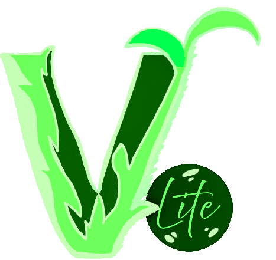

# 

**VGSLite** is a R based helper application built to support VGS 5 Desktop on Windows devices.

## Installation

To install [**VGSLite**](https://github.com/tgilbert14/VGSLite) on your Windows device:

1.  Download the latest release from [VGSLite](https://github.com/tgilbert14/VGSLite/releases/tag/v2.0).
2.  Unzip the folder and run the latest `VGSLite Setup.exe`.
3.  You may have to click "more info" in order to install the application.

## Features

-   ✅ **Check for var and sub species:** Checks for variety and subspecies being used. These are often entered by mistake. This allows the user to download a list of species of interest being used.

-   ✅ **Clean Database:** Cleans up any orphan data links that may exist to help prevent corrupt data. Often used before "Empty Tombstone" to troubleshoot sync issues.

-   ✅ **Convert database to Local:** Moves cloud data into local folders. **NOT** recommended unless you plan on only collecting data locally.

-   ✅ **Delete Unassigned data:** Deletes all data and sites inside the "Unassigned" bin at once instead of going though each event.

-   ✅ **Empty Tombstone:** Clears deletion cache, often used to troubleshoot sync issues.

-   ✅ **Move Event:** Lets user move a single event from an existing site to another site. Often used when an event was put on the wrong site. This **WILL NOT UPDATE SYNC STATE** *(i.e., cloud-to-local or local-to-cloud).*

-   ✅ **Update Species (Frequency/DWR):** Lets user update a species in every instance it occurs for frequency and DWR methods for all data downloaded onto VGS5 device*.* Provides a downloadable csv file to track updates and checks for possible issues with updates.

## Usage

After launching the app:

-   ✅ Select a task from the drop-down (*e.g., "Move Event"*).

-   ✅ Follow prompts (*e.g., Select Site to **move from**, Site to **move to**, and **date of Event** to move, then confirm selections*).

-   ✅ Click through confirmation pop-ups to see what is being done.

-   ✅ Make sure to close out VGS 5 if open, and reopen it to confirm changes.

## License

MIT License --- see `LICENSE.md` for details.

Icons by [Icons8](https://icons8.com/)

## Contact

For questions or bug reports, reach out to [tsgilbert\@arizona.edu](mailto:tsgilbert@arizona.edu){.email} or open an issue on GitHub.
